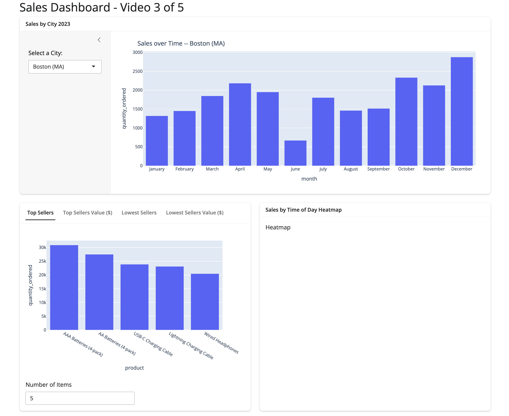

# Projetos Shiny em Python
Aplicações interativas desenvolvidas com o Shiny Framework para Python.

Dashboard de Ordens de Serviço (OS)
Dashboard de OS

Este projeto utiliza Shiny para Python para criar um dashboard interativo com dados de ordens de serviço. Ele explora conceitos de reatividade, ajustes de layout e personalização visual para criar uma interface dinâmica.

📊 Funcionalidades principais:
✅ Interatividade: O usuário pode selecionar um executor e visualizar os dados correspondentes. ✅ Gráficos dinâmicos: Utiliza Plotly para exibir gráficos de distribuição de OS. ✅ Visualização responsiva: Ajuste automático do layout para diferentes dispositivos. ✅ Manipulação de dados: Usa Pandas para carregar e processar os dados.

🔹 Código-fonte completo: Link do repositório

## Seções do Projeto
Parte 1: Como Criar, Implantar e Compartilhar um Aplicativo Shiny em 20 Minutos

Walks through the basics of getting started with Shiny for Python and we build and deploy a simple app by the end of the video.

🔹 Código final: Link do código 📺 Vídeo tutorial: Assista aqui

### Parte 2: Como Criar Dashboards Interativos com Shiny! (Reatividade)

Explicação sobre reatividade no Shiny e como manipular interações dentro do dashboard.

🔹 Código final: Link do código 📺 Vídeo tutorial: Assista aqui

### Parte 3: Como Deixar Seu Dashboard Profissional! (Layouts no Shiny)

Melhorias na aparência do dashboard usando layouts flexíveis e responsivos.

🔹 Código final: Link do código 📺 Vídeo tutorial: Assista aqui

### Parte 4: Como Integrar Matplotlib, Plotly e Seaborn em um Único Dashboard!

Técnicas para combinar diferentes bibliotecas de visualização no Shiny.

🔹 Código final: Link do código 📺 Vídeo tutorial: Assista aqui